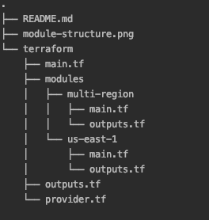

# Kustomer

This repository consists the solution to the following three exercises:

````
1. We want to be able to run this same stack closer to our customers in the US. Please
build the same stack in the us-east-1 (Virginia) region, leaving the existing one in place
too. Feel free to modify the Terraform code and/or structure as much as needed in order
to do this. Use any RFC-1918-compliant CIDR for your new VPC.

2. Virginia has several availability zones -- we want to use 4. Yet we still want to run the
stack in Dublin using the 3 AZs there. Modify the Virgina stack to span 4 AZs. Do this
however you like, but consider that we would like to see reusable code.

3. Imagine the EC2 instance running Nginx went down over the weekend. We had an
outage, it's been decided that we need a solution that is more resilient than just a single
instance. Please implement a highly available solution that you'd be confident would
continue to run in the event one instance goes down.
````

## Setup:

1. awscli installed, aws credentials setup and make sure you have enough permissions to create the stack

2. terraform version v0.12.24


### Provisioning
- initialize backend to maintain state and the modules
  - `terrafrom init`
- see planned changes
  - `terraform plan`
- apply changes
  - `terraform apply`

## Module structure




### There are basically two modules which solves above exercises:

#### For Exercise 1:

terraform/modules/multi-region/ : It consists all the common code for both regions (Dublin and Virginia). It spins up a similar stack in Virginia region as Dublin

#### For Exercise 2:

terraform/modules/us-east-1/ : It consists extra resources like 4th AZ and copying AMI from Dublin to Virginia

#### For exercise 3:

terraform/modules/multi-region/ : It consists of a High availibility load balancer which sends traffic to two identical instances in different availability zones

#### Output

Once the terraform plan has been applied, it's going to display the load balancer DNS name in each region


#### Note

The copy ami from eu-west-1 to us-east-1 takes around 4-5 minutes, so stack would take sometime to be built in Virginia

